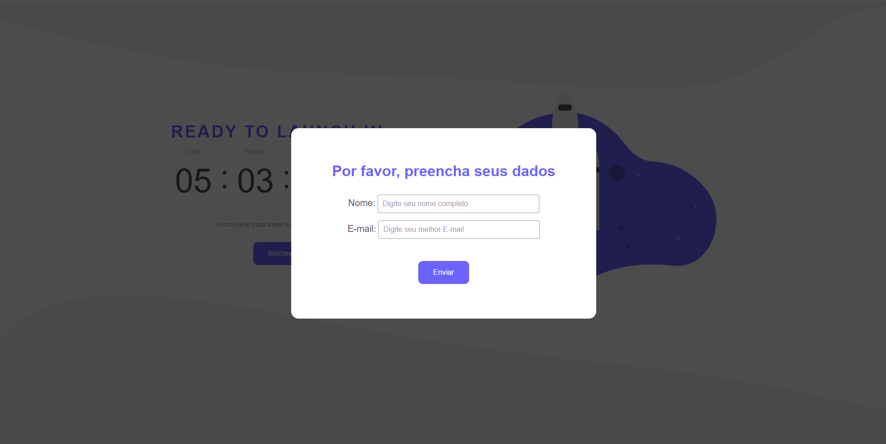

# Rocketseat - Count challenge

This is a solution to the [Countdown](https://efficient-sloth-d85.notion.site/Desafio-Countdown-4572ce6f5c91469abe0171f454a13e3f) challenge on Rocketseat Discover.

## Getting Started

You can run Live Server, or copy index.html path and paste into the browser.

# Project view

  
  
  

## Technologies

- HTML
- CSS
- JavaScript

## 🔗 Links

## Badges

